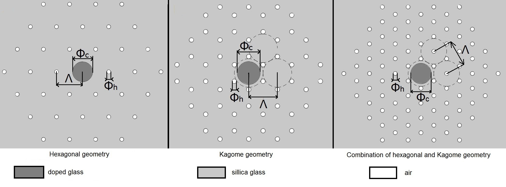

# Normal dispersion supercontinuum reaching mid-infrared in silica microstructured optical fibers
The official repository for poster at ICNP 2018.

[http://www.icnp2018.pwr.edu.pl/conference/](http://www.icnp2018.pwr.edu.pl/conference/)

## Table of contents
* [General info](#general-info)
* [Programming language](#Technologies-used)
* [Citation](#citation)
* [Status](#status)

## General info
Since the first observation of supercontinuum generation in borosilicate glass in 1970, 
this process has been thoroughly investigated. It was shown that the large spectra broadening is obtained 
by pumping microstructured optical fiber close to zero dispersion wavelength. 
Ultra-broad spectrum with uniform spectral energy density can be generated in an all-normal dispersion (ANDi) 
microstructured fiber. However, to achieve effective supercontinuum generation in ANDi regime, 
it is beneficial to match the pump wavelength and the local maximum of dispersion curve. 
The possibility of obtaining a generation of ANDi SC was analyzed by Hartung et al., 
who showed that photonic fibers are characterized by high flexibility in modeling the location 
of the maximum dispersion. It was shown recently, that a~design combining 
microstructured silica cladding with Ge-doped silica core allows to generate a supercontinuum extending beyond 2.5um. 
The great advantage of this design is compatibily with telecommunication technology.

In this work we determine the optimal pumping conditions such as pulse peak power, 
central wavelength and duration for optimized microstructured fibers proposed in [(J.Biedrzycki, Opto-Electronics Review 26 (1):57-62, 2018)](https://www.sciencedirect.com/science/article/abs/pii/S1230340217300446). 
To study the influence of pumping parameters on the SC characteristics (its width and flatness) we use 
a self-developed software solving the generalized nonlinear Schr\"odinger equation (GNLSE) 
with the fourth-order Runge-Kutta in the Interaction Picture (RK4IP) method. 
In the simulations, we assume the Raman response function as given by Stolen. 
Additionally, we accounted for dispersion of effective mode area using the envelope normalization 
proposed by Laegsgaard and loss. 
Our simulations show that ANDi SC generated in proposed fibers covers whole transparency window of silica glass.



## Technologies used
* Matlab
* Comsol

## Citation

```
@article{MajchrowskaICNP:18,
    author = {Sylwia Majchrowska and Karol Tarnowski},
    journal = {ICNP 2018},
    title = {Normal dispersion supercontinuum reaching mid-infrared in silica microstructured optical fibers}
    year = {2018},
}
```

## Status
Project is: _finished_
